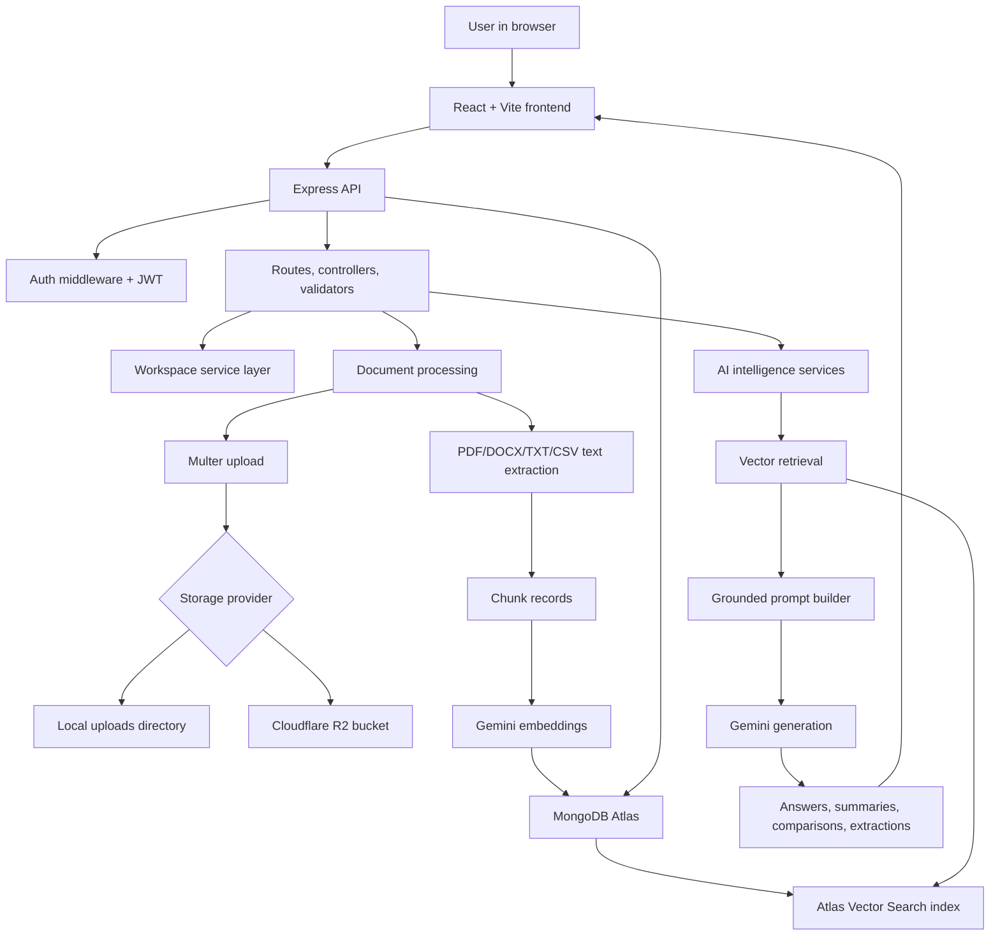
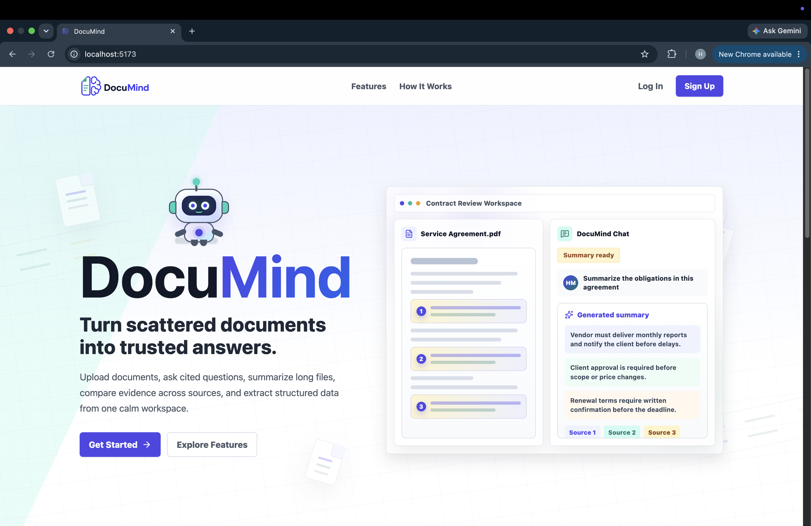
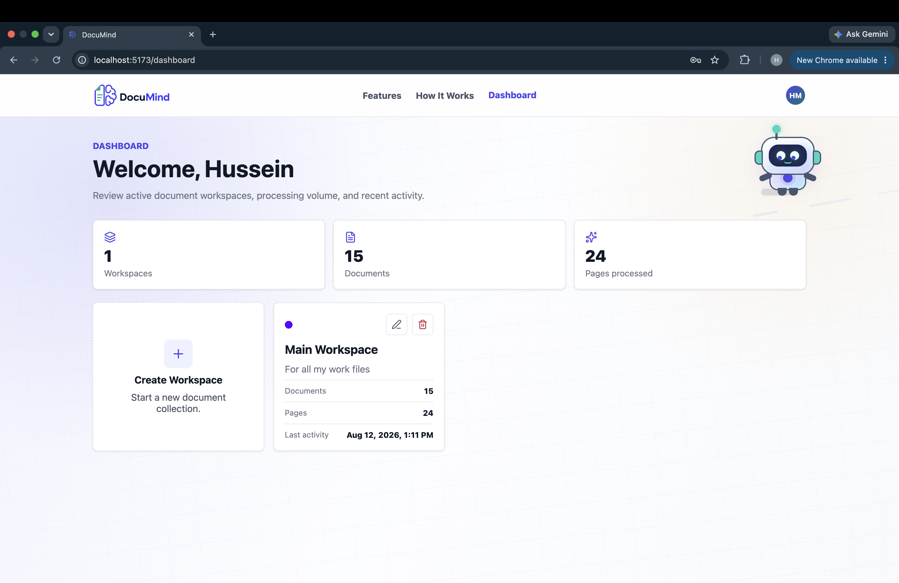
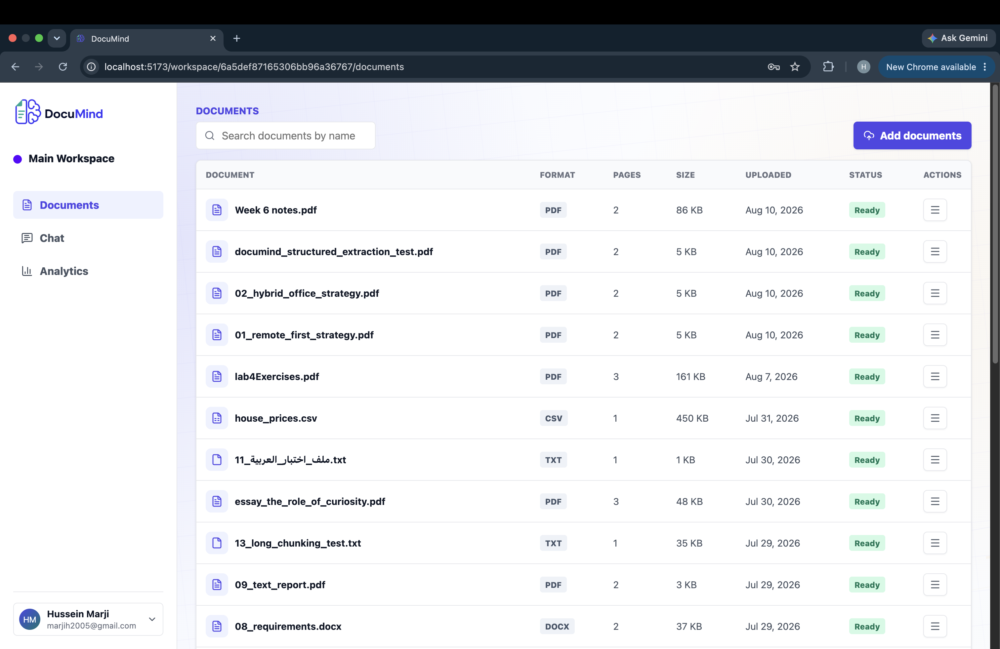
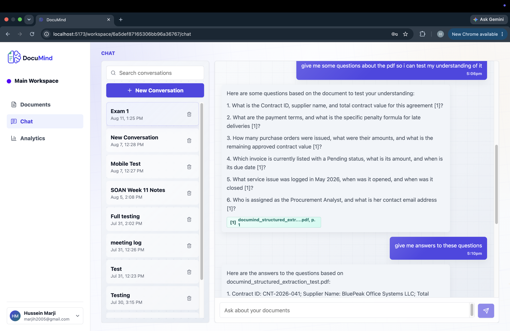
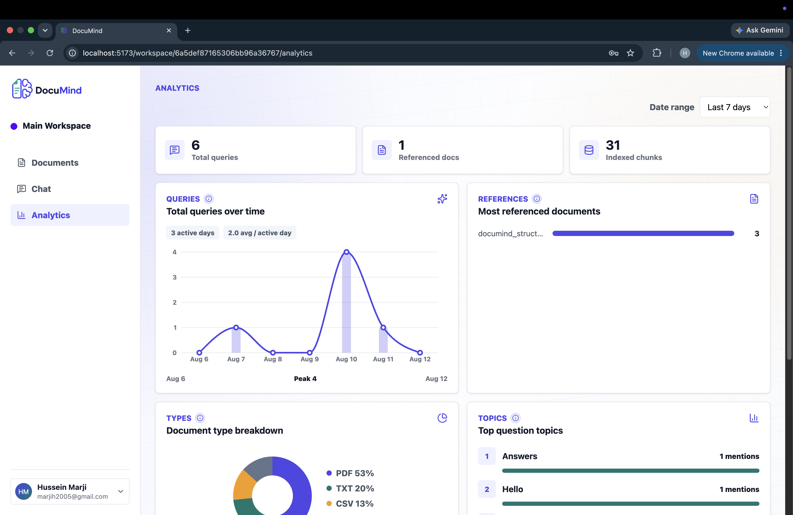
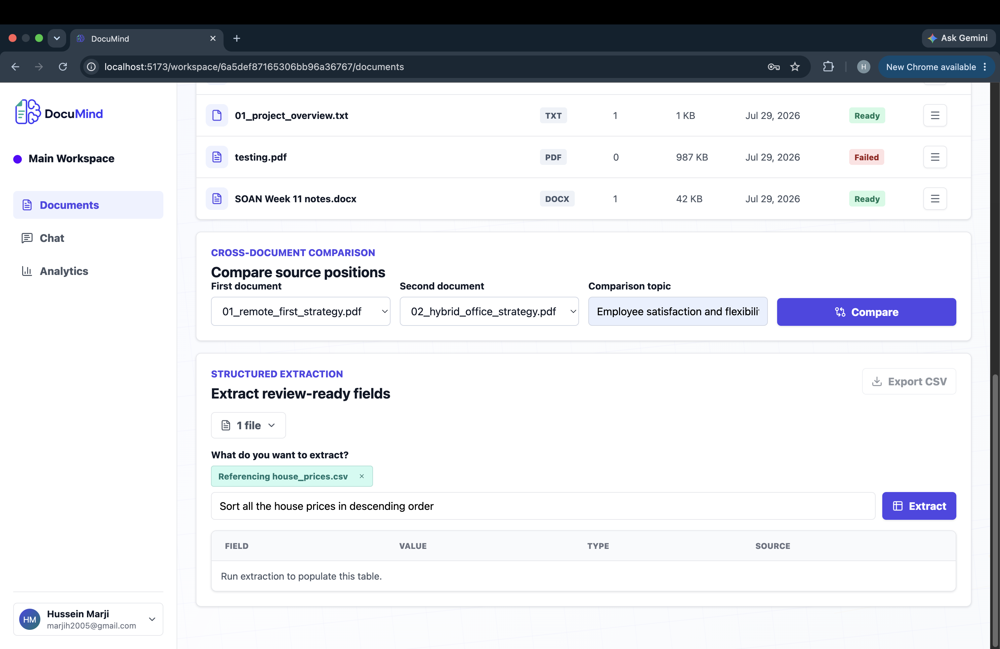

# DocuMind

DocuMind is a document intelligence workspace for uploading, organizing, previewing, summarizing, searching, and asking questions across files. It combines a React frontend, an Express API, MongoDB document metadata, Atlas Vector Search, and Gemini-powered embeddings/generation to provide grounded answers with citations.

The app supports authenticated users, per-user workspaces, document upload and processing, RAG chat, cached summaries, analytics, structured extraction, cross-document comparison, and optional Cloudflare R2 object storage.

## Features

- User registration, login, session restoration, and protected workspace routes.
- Workspace dashboard with document counts, page counts, storage usage, recent activity, and analytics.
- PDF, DOCX, TXT, and CSV upload with duplicate checks, 10 MB file limit, processing status, and retry support.
- Document previews for uploaded files, including CSV table previews and PDF/DOCX/TXT text extraction.
- Chunking and Gemini embeddings stored in MongoDB for Atlas Vector Search retrieval.
- Semantic search across workspace chunks.
- RAG chat with conversation history, document focus, `@document` references, citations, and source previews.
- Summary generation at `one-liner`, `executive`, and `detailed` levels with cached results.
- Structured extraction from one or more documents into tabular fields.
- Cross-document comparison for two ready documents on a selected topic.
- Optional Cloudflare R2 storage for uploaded document files.
- Security middleware with Helmet, CORS, and API/auth rate limiting.

## Tech Stack

| Area | Technology |
| --- | --- |
| Frontend | React 19, Vite, React Router, Lucide React |
| Backend | Node.js, Express 5, Mongoose, JWT, Multer |
| Database | MongoDB Atlas |
| Vector Search | MongoDB Atlas Vector Search |
| AI | Google Gemini API for embeddings and generated responses |
| Document Processing | `pdf-parse`, `mammoth`, `jszip`, CSV parsing utilities |
| Storage | Local filesystem by default, optional Cloudflare R2 |
| Security | Helmet, CORS, `express-rate-limit`, request validation |

## Architecture



### Data Flow

1. A user signs in and creates a workspace.
2. The frontend uploads a document to the backend as multipart form data.
3. The backend stores the file locally or in Cloudflare R2, extracts text, splits it into chunks, generates embeddings, and stores metadata/chunks in MongoDB.
4. Search, chat, extraction, and comparison requests retrieve relevant chunks through Atlas Vector Search.
5. Gemini receives a source-grounded prompt and returns a generated response with citations back to the frontend.

## Screenshots

| Screen | Preview |
| --- | --- |
| Landing page |  |
| Workspace dashboard |  |
| Workspace documents tab |  |
| Chat with citations |  |
| Analytics dashboard |  |
| Extraction and comparison tools |  |

## Project Structure

```text
DocuMind/
  backend/
    src/
      config/          Environment and MongoDB connection
      controllers/     Request handlers
      middleware/      Auth, validation, upload, errors
      models/          Mongoose models
      routes/          API route definitions
      services/        Chunking, embeddings, RAG, summaries, storage
    uploads/           Local document storage when enabled
  frontend/
    src/
      components/      Shared UI components
      context/         Auth context
      layouts/         App layout
      pages/           Home, auth, dashboard, workspace views
      services/        API client
```

## Prerequisites

- Node.js 20 or newer.
- npm.
- MongoDB Atlas cluster.
- MongoDB Atlas Vector Search index for chunk embeddings.
- Gemini API key for embeddings, summaries, chat, extraction, and comparison.
- Optional Cloudflare R2 bucket and API credentials.

## Setup

Install backend dependencies:

```bash
cd backend
npm install
```

Install frontend dependencies:

```bash
cd ../frontend
npm install
```

Create environment files:

```bash
cd ..
cp backend/.env.example backend/.env
cp frontend/.env.example frontend/.env
```

Update `backend/.env` with MongoDB, JWT, Gemini, and optional R2 values. Update `frontend/.env` if the backend API URL is different from the default.

Start the backend:

```bash
cd backend
npm run dev
```

Start the frontend in a second terminal:

```bash
cd frontend
npm run dev
```

Default local URLs:

- Frontend: `http://localhost:5173`
- Backend API: `http://localhost:5000`
- API base URL: `http://localhost:5000/api`

## Environment Variables

### Backend

| Variable | Required | Default | Description |
| --- | --- | --- | --- |
| `NODE_ENV` | No | `development` | Runtime environment. |
| `PORT` | No | `5000` | Express server port. |
| `CLIENT_URL` | No | `http://localhost:5173` | Allowed CORS origin for the frontend. |
| `MONGODB_URI` | Yes | None | MongoDB Atlas connection string. |
| `JWT_SECRET` | Yes | None | Secret used to sign auth tokens. |
| `JWT_EXPIRES_IN` | No | `7d` | JWT expiration window. |
| `GEMINI_API_KEY` | Yes for AI features | None | Google Gemini API key. |
| `GEMINI_EMBEDDING_MODEL` | No | `gemini-embedding-2` | Model used for document and query embeddings. |
| `GEMINI_EMBEDDING_BATCH_SIZE` | No | `8` | Number of chunks embedded per request batch. |
| `GEMINI_EMBEDDING_REQUEST_DELAY_MS` | No | `250` | Delay between embedding batches. |
| `GEMINI_EMBEDDING_TIMEOUT_MS` | No | `30000` | Embedding request timeout in milliseconds. |
| `GEMINI_GENERATIVE_MODEL` | No | `gemini-flash-latest` | Model used for answers, summaries, extraction, and comparison. |
| `GEMINI_GENERATIVE_TIMEOUT_MS` | No | `30000` | Generative request timeout in milliseconds. |
| `VECTOR_SEARCH_INDEX_NAME` | No | `chunk_embedding_vector_index` | Atlas Vector Search index name for chunk embeddings. |

### Optional Cloudflare R2 Storage

| Variable | Required | Default | Description |
| --- | --- | --- | --- |
| `DOCUMENT_STORAGE_PROVIDER` | No | `local` or auto-detected `r2` | Use `local` or `r2`. |
| `R2_ACCOUNT_ID` | Required for R2 | None | Cloudflare account ID. |
| `R2_ACCESS_KEY_ID` | Required for R2 | None | R2 access key ID. |
| `R2_SECRET_ACCESS_KEY` | Required for R2 | None | R2 secret access key. |
| `R2_BUCKET_NAME` | Required for R2 | `documind-documents` | R2 bucket for uploaded documents. |
| `R2_ENDPOINT` | Required for R2 | None | S3-compatible R2 endpoint URL. |

If `DOCUMENT_STORAGE_PROVIDER=r2`, all R2 values must be present. If `DOCUMENT_STORAGE_PROVIDER` is omitted and all R2 values are present, the backend can use R2 automatically.

### Frontend

| Variable | Required | Default | Description |
| --- | --- | --- | --- |
| `VITE_API_BASE_URL` | No | `http://localhost:5000/api` | Backend API base URL used by the React app. |

## MongoDB Atlas Vector Search

DocuMind stores chunk embeddings with 768 dimensions. Create an Atlas Vector Search index on the chunks collection using the same name as `VECTOR_SEARCH_INDEX_NAME`.

Recommended index shape:

```json
{
  "fields": [
    {
      "type": "vector",
      "path": "embedding",
      "numDimensions": 768,
      "similarity": "cosine"
    },
    {
      "type": "filter",
      "path": "workspaceId"
    },
    {
      "type": "filter",
      "path": "documentId"
    }
  ]
}
```

## API Reference

Protected endpoints require:

```http
Authorization: Bearer <token>
```

All JSON responses use a `success` boolean. Error responses include a `message` and may include validation `errors`, retry metadata, or provider finish reasons.

### Base

| Method | Endpoint | Auth | Description |
| --- | --- | --- | --- |
| `GET` | `/` | No | API welcome response. |
| `GET` | `/api/health` | No | Health check. |

### Auth

| Method | Endpoint | Auth | Body | Description |
| --- | --- | --- | --- | --- |
| `POST` | `/api/auth/register` | No | `firstName`, `lastName`, `email`, `password` | Create an account and return a JWT. |
| `POST` | `/api/auth/login` | No | `email`, `password` | Authenticate and return a JWT. |
| `GET` | `/api/auth/me` | Yes | None | Return the current user and storage usage. |

Password requirements: at least 8 characters, one lowercase letter, one uppercase letter, and one number.

### Workspaces

| Method | Endpoint | Body or query | Description |
| --- | --- | --- | --- |
| `GET` | `/api/workspaces` | None | List the current user's workspaces with document/page counts and activity. |
| `POST` | `/api/workspaces` | `name`, optional `description`, optional `color` | Create a workspace. |
| `GET` | `/api/workspaces/:id` | None | Get one workspace. |
| `PUT` | `/api/workspaces/:id` | Optional `name`, `description`, `color` | Update workspace metadata. |
| `DELETE` | `/api/workspaces/:id` | None | Delete a workspace and its related documents, chunks, summaries, conversations, and messages. |
| `GET` | `/api/workspaces/:id/analytics?days=7\|30\|90` | Optional `days` | Return workspace usage analytics. |

`color` must be a hex color like `#2563eb`.

### Documents

| Method | Endpoint | Body | Description |
| --- | --- | --- | --- |
| `GET` | `/api/workspaces/:id/documents` | None | List documents in a workspace. |
| `POST` | `/api/workspaces/:id/documents` | Multipart `file`, optional `originalName` | Upload and process a document. |
| `PUT` | `/api/workspaces/:id/documents/:documentId` | `originalName` | Rename a document. |
| `DELETE` | `/api/workspaces/:id/documents/:documentId` | None | Delete a document and related chunks/summaries. |
| `GET` | `/api/workspaces/:id/documents/:documentId/preview` | None | Return extracted preview content. |
| `GET` | `/api/workspaces/:id/documents/:documentId/file` | None | Stream or download the stored file. |
| `POST` | `/api/workspaces/:id/documents/:documentId/reprocess` | None | Re-run extraction, chunking, and embedding. |

Supported file types are PDF, DOCX, TXT, and CSV. Files cannot exceed 10 MB.

Document statuses:

- `uploaded`
- `processing`
- `ready`
- `failed`

Processing stages:

- `queued`
- `extracting`
- `chunking`
- `embedding`
- `ready`
- `failed`

### AI And Document Intelligence

| Method | Endpoint | Body | Description |
| --- | --- | --- | --- |
| `GET` | `/api/workspaces/:id/documents/:documentId/summaries` | None | List cached summaries for a document. |
| `POST` | `/api/workspaces/:id/documents/:documentId/summarize` | `level`, optional `force` | Generate or refresh a document summary. |
| `POST` | `/api/workspaces/:id/search` | `query`, optional `limit` | Return relevant chunks from Atlas Vector Search. |
| `POST` | `/api/workspaces/:id/answer` | `query`, optional `limit`, `documentIds`, `conversationHistory` | Generate a grounded answer with citations. |
| `POST` | `/api/workspaces/:id/extract` | `prompt`, optional `limit`, `documentIds` | Extract structured fields into tabular rows. |
| `POST` | `/api/workspaces/:id/compare` | `firstDocumentId`, `secondDocumentId`, `topic`, optional `limit` | Compare two ready documents on a topic. |

Summary levels:

- `one-liner`
- `executive`
- `detailed`

Search and answer limits must be between 1 and 20. Comparison limits must be between 1 and 10. Extraction can target up to 20 selected documents.

### Conversations

| Method | Endpoint | Body | Description |
| --- | --- | --- | --- |
| `GET` | `/api/workspaces/:id/conversations` | None | List conversations in a workspace. |
| `POST` | `/api/workspaces/:id/conversations` | Optional `title` | Create a conversation. |
| `PUT` | `/api/workspaces/:id/conversations/:conversationId` | `title` | Rename a conversation. |
| `DELETE` | `/api/workspaces/:id/conversations/:conversationId` | None | Delete a conversation and its messages. |
| `GET` | `/api/workspaces/:id/conversations/:conversationId/messages` | None | List conversation messages. |
| `POST` | `/api/workspaces/:id/conversations/:conversationId/messages` | `role`, `content`, optional `citations` | Persist a user or assistant message. |

Conversation message roles are `user` and `assistant`.

## Development Notes

- Root README is the primary project documentation.
- Backend scripts:
  - `npm run dev`: start the API with Nodemon.
  - `npm start`: start the API with Node.
- Frontend scripts:
  - `npm run dev`: start Vite.
  - `npm run build`: build the production frontend.
  - `npm run lint`: run ESLint.
  - `npm run preview`: preview the built frontend.
- Local uploads are stored under `backend/uploads/documents` when local storage is enabled.
- User storage is capped at 100 MB.
- Chunk embeddings are generated for retrieval and stored on chunk records.
- Query embeddings are generated on demand and are not persisted.
- Generated answers, summaries, extractions, and comparisons should only use retrieved source content.

## Verification

After merging all feature branches and configuring environment variables:

```bash
cd frontend
npm run lint
npm run build
```

Then start the backend and frontend:

```bash
cd backend
npm run dev
```

```bash
cd frontend
npm run dev
```

Manual smoke test:

1. Register or log in.
2. Create a workspace.
3. Upload a PDF, DOCX, TXT, or CSV.
4. Wait for the document to reach `ready`.
5. Preview the document.
6. Generate each summary level.
7. Ask a question in chat and open a citation.
8. Run semantic search.
9. Check analytics for 7, 30, and 90 days.
10. Run structured extraction.
11. Compare two ready documents.

## Planned Screenshot Checklist

Before publishing the README externally, verify the screenshots above render correctly in GitHub preview.
